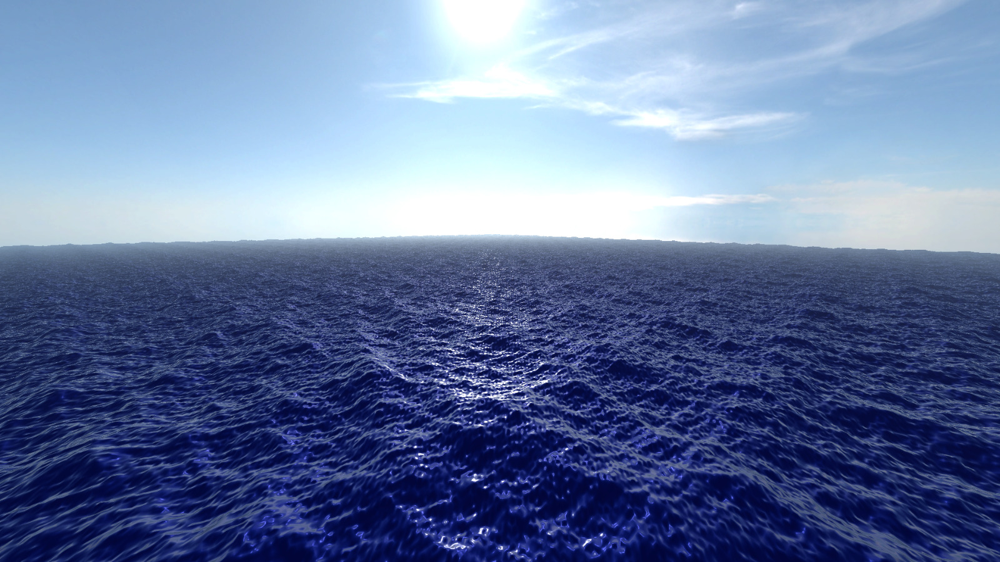
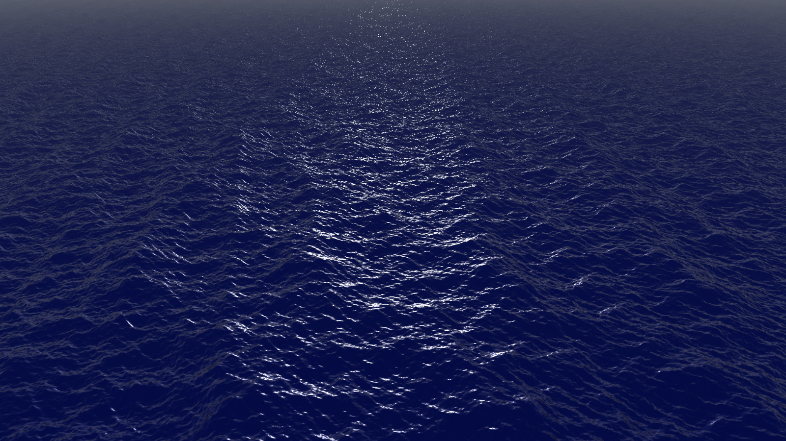
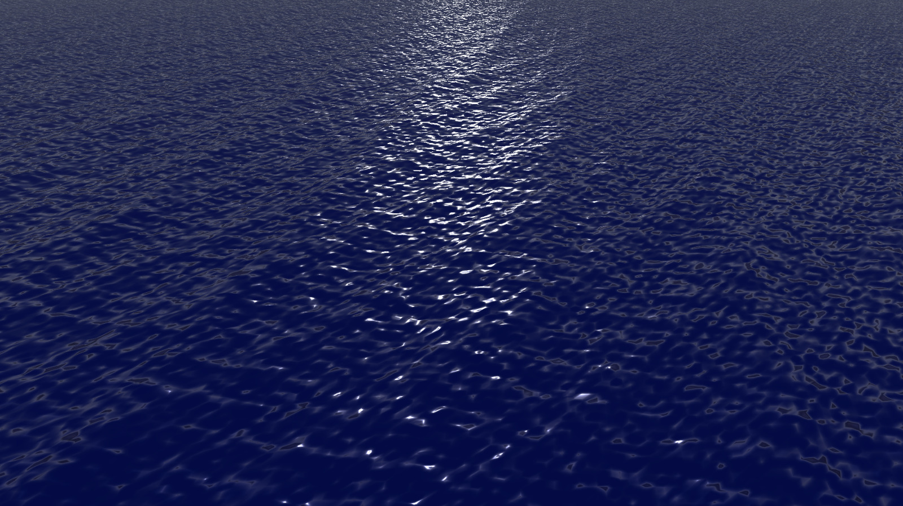

This is a simple project to test the GPU in Godot. I tried to learn some Godot
shaders and I created this project to test them. Some simple Water shaders are
made. In the goal of creating a simple primitive wave based model of the ocean
surface.

Nothing fance, I wil try to make it better in the future. Way in the future.
Also most importantly, the performance is abismal, or I don't know how to
make it look better.

Results :

